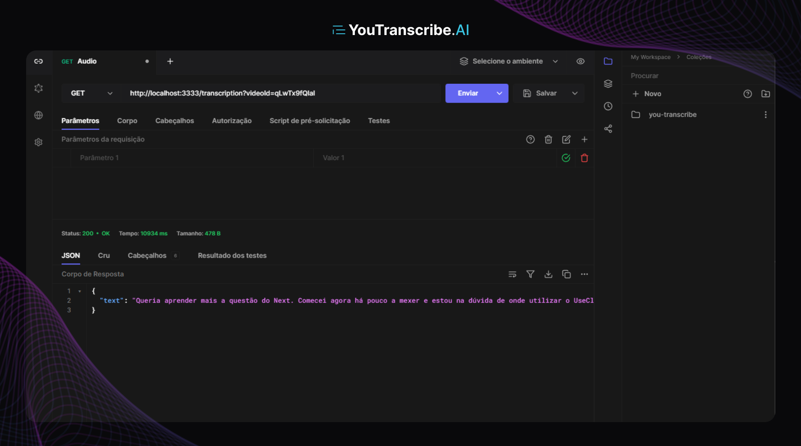

# About

An API that allows you to download YouTube videos, convert them to MP3, automatically transcribe videos into text and generate summaries with artificial intelligence

## Requisites

- Node.js;

## Technologies

- Fastify;
- Typescript
- Openai;
- Zod;

## Setup

- Clone the repository;
- Install dependencies (`pnpm install`);
- Get your free key with [openai](https://openai.com/).
- Copy `.env.example` file (`cp .env.example .env`);
- Run application (`pnpm run dev`);
- Test it! (I personally recommend testing with [Hoppscotch](https://hoppscotch.io/)).

## HTTP

### GET `/transcription?videoId={id}&lang={lang}`

Return transcription data

#### Response body

```json
{
  "text": "Lorem Ipsum is simply dummy text of the printing and typesetting industry. Lorem Ipsum has been the industry's standard dummy text ever since the 1500s"
}
```
